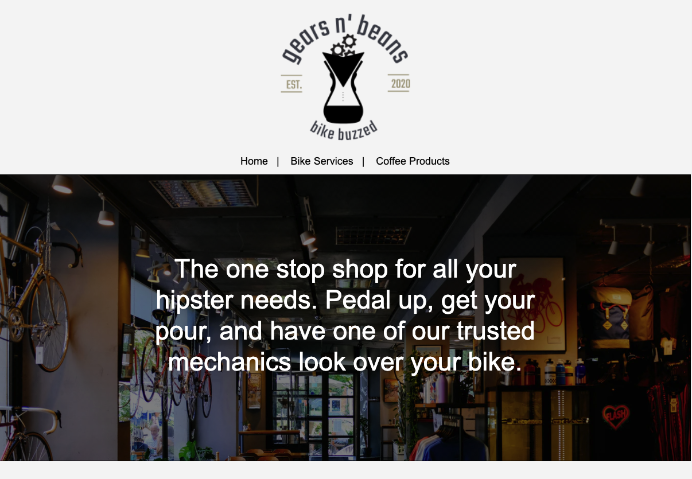
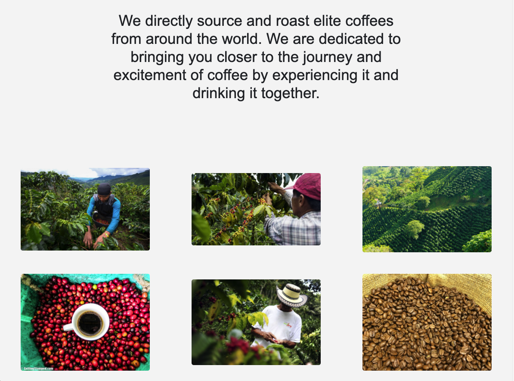
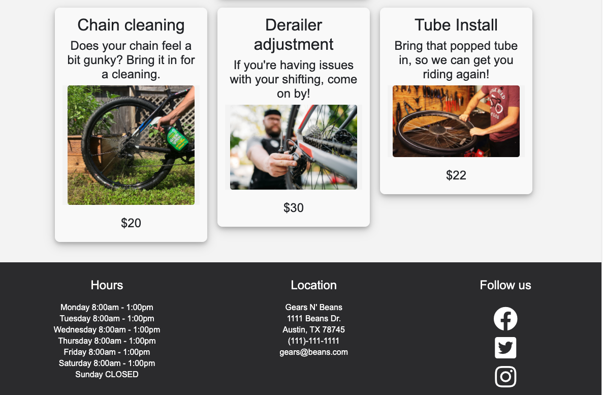
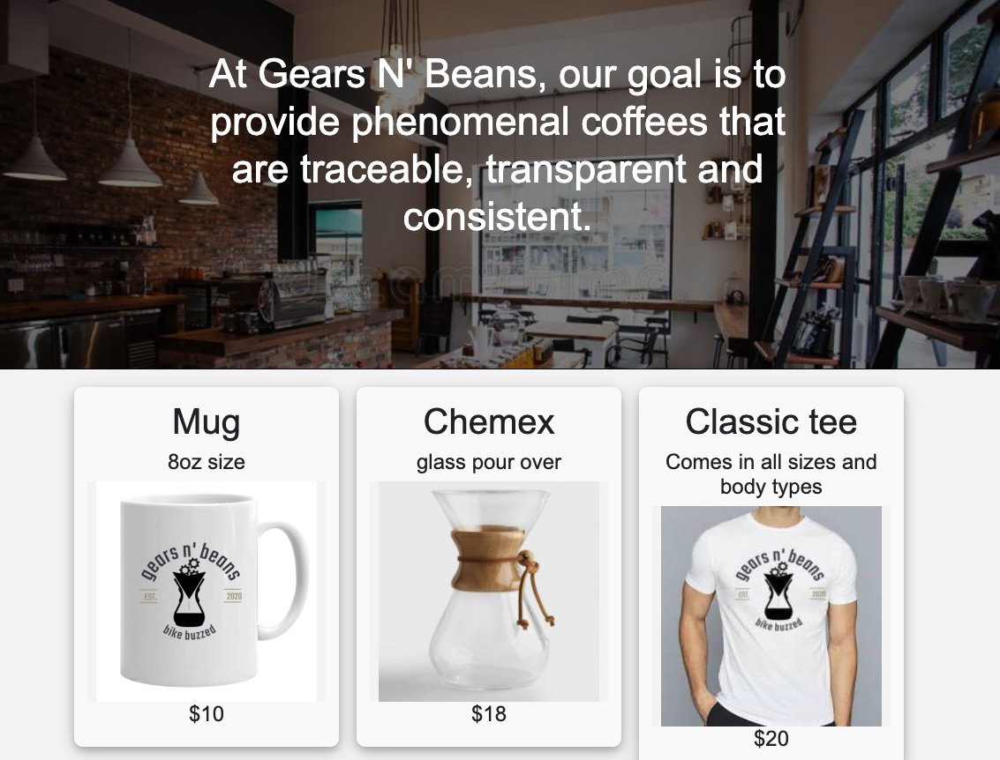

# Gears N' Beans

This is a website for a company that sells coffee products and offers bike services. The user can view the products, services and learn more about the company. <em>This is not a real company.</em>

## Technologies Used:

VENM Stack project

- Vue.js (Vue 3)
- Express.js
- MongoDB
- Node.js
- Vue Router
- NPM
- React.js
- Javascript
- CSS3
- Bootstrap
- FontAwesome
- HTML5
- Heroku
- Google Maps

<!-- ### Project setup

```
npm init
node server.js

or

yarn install
npm init
yarn serve
``` -->

## Screenshots

##### Home Page(top-portion)



##### Home Page(bottom)



##### Services & Footer



##### Products



## Final App

[Click Here](https://gears-beans-client.herokuapp.com/) for the deployed app

### Future Enhancements

- Authentication (firebase)
- Meet our team page
- update and edit reviews
- Add to cart feature (commerce.js)
- Message company form (nodemailer)

<!-- GMap and GMapCopy both work -different ways of doing it -->
  <!-- ### Compiles and minifies for production

```
yarn build
```
